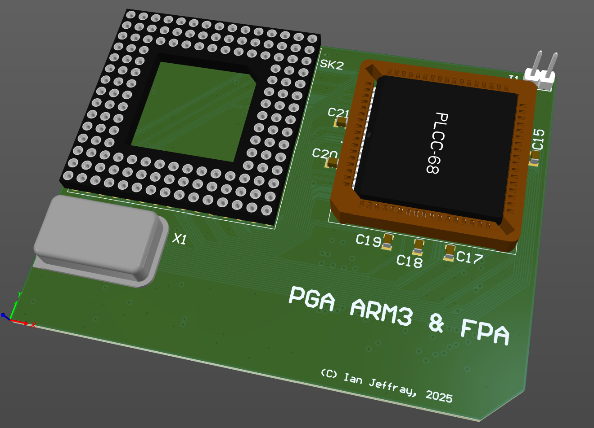

# Acorn A3000 ARM3 (PGA) processor card, with FPA.

April 2024

This is my implementation of an ARM3 (PGA) upgrade card with FPA that will plug in to the ARM2 socket on Acorn A3000 machines.

The QFP+FPA version of this board has been tested successfully using 25MHz and 33MHz parts recovered from dead A5000 machines, and my A540 PGA ARM3 + FPA card has been successfully tested in several systems, so this project simply brings those two projects together.

Due to using a through-hole PGA part, this must sit beside rather than above the original ARM2 socket, so layout choices are forced - this means that this variant of the card will not fit in other machines such as A300/A400; the podule backplane connector would be obscured.    Other manufacturers have addressed this by surface-mounting the through-hole PGA socket, however this has proved rather unreliable, so this project sticks to standard methods.

Multiple options are provided for clock source - standard oscillator, SMT oscillator and ICD2053 clock generator.

This is a work in progress...

## Licence

No warranty is provided, and this work is used at your own risk.  

Licenced as CC BY-SA 4.0

Copyright 2024 Ian Jeffray

